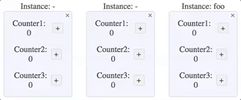

# Vuex+ [](https://travis-ci.org/presidenten/vuex-plus)
Vuex+ is an opinionated library that makes Vuex module instances possible.
```html
<counterGroup></counterGroup>
<counterGroup></counterGroup>
<counterGroup instance="foo"></counterGroup>
```


**Enhancements:**
- Dynamic root level module instances that can be shared across components
  - Instances get their Vuex path extended with their instance name
  `foo` with instance `bar`, becomes `foo$bar`
- Root level instances can be preserved or cleared when components are destroyed
- Module states are decorated with a `$parent`-state object getter
  - Yes, still serializable states
  - Yes, still injectable states through devtools
- Static submodule instances
- `Vuex+` map.getters and map.actions expand module paths to full paths when component nesting order is same as vuex module nesting order
- Automatic Vuex HMR (needs naming conventions)
- Modules are automatically get `name` and `namespaced` parameters set
- Works side by side with normal vuex modules. By following the file naming convention they also get full automatic HMR handling.


_These enhancements from v1 are deprecated, but still working for now:_
- _(Generated API with magic strings in all vuex modules for getters/actions/mutations)_
- _(Generated global API with magic strings for global getters/actions/mutations)_

### How to use
Check out the extensive tutorial bundled with the example:
[https://github.com/presidenten/vuex-plus-demo](https://github.com/presidenten/vuex-plus-demo)

### Requirements
- Webpack
- Naming conventions for:
  - Vuex module filenames
  - Vuex submodule filenames


## Exported properties

**Used in `main.js`:**
- `default`:
```javascript
    import Vue from 'vue';
    import Vuex from 'vuex';
    import VuexPlus from 'vuex-plus';

    Vue.use(Vuex);
    Vue.use(VuexPlus.getVuePlugin(Vue)); // Adds global vuex+ mixin to components

    const store = new Vuex.Store({
      plugins: [VuexPlus.getVuexPlugin(Vuex)], // Patch vuex for $parent & bootstrap HMR
    });

    new Vue({
      el: '#app',
      store,
      render: h => h(require('./app.vue')), // Start application
    });
```

---

**Used in vuex modules:**
- `store`: Method used to wrap Vuex module definitions to make them into `Vuex+ modules`
  ```javascript
  import { store } from 'vuex-plus';
  export default store({
    state,
    getters,
    ...
  });
  ```
- `newInstance`: Wrapper to make new submodule instance
  ```javascript
  import { store, newInstance } from 'vuex-plus';
  import submodule from './a-submodule.js';

  const submodule$foo = newInstance(submodule, 'foo');
  const submodule$bar = newInstance(submodule, 'bar');

  export default store({
    modules: {
      submodule$foo,
      submodule$bar,
    },
  });
  ```

- `root`: Object used for easy access to various application getters/actions.
  ```javascript
  import { root } from 'vuex-plus';
  ```
  - Use paths with absolute path to reach anywhere in the application.
  ```javascript
      root.get{ path: 'a/b$foo/someGetter' };
      root.dispatch{ path: 'c$foo/d$bar/someAction', data: 42 };
  ```
  - Use together with `context.state` for easy access in the same instance tree. Two path keywords expands to path within the instance:
    - `'$root'` - Expands to root the level root level module with its instance
    ```javascript
          root.get({ path: '$root/someGetter', state: context.state });
          // expands to root.get({ path: 'a/someGetter' });
    ```
    - `'$parent'` - Expands to the parent module with all instances needed
    ```javascript
          root.get({ path: '$parent/someGetter', state: context.state });
          // expands to root.get({ path: 'a/b$foo/someGetter' });
    ```

---

**Used in components:**
- `root`: Same as above, but only absolute paths work
- `map`: `Vuex+` own version of `mapGetters`/`mapActions` with module namespacing handled, when that the component tree and their vuex models are nested in the same way.
  If vuex modules are nested like so
  ```
    a
      b$chuu
        c
  ```
  The vuex modules mapping them, needs the same order, even if other components can be squeezed in between:
  ```
    A(a)           // Mapping a
      Foo
        B(b)       // Mapping b
          Bar
            Piri
              C(c) // Mapping c
  ```

  - `map.getters()` and `map.actions()` expand vuex paths and adds parent instances
    ```javascript
      <script>
        import { map } from 'vuex+';

        export default {
          computed: {
            ...map.getters({
              count: 'c/someGetter', // expands to 'a/b$chuu/c/someGetter'
            }),
          },
        }
      </script>
---

## Setup in webpack
- Resolve `vuex+` as `vuex-plus`
```javascript
resolve: {
  alias: {
    'vuex+': 'vuex-plus',
  }
},
```
- Use `vuex+` loader to add names to module stores
```javascript
module: {
  rules: [
    {
      test: /-(store|substore)\.js$/,
      loader: 'vuex-plus/loader',
    },
  ],
},
```
- Vuex HMR setup:
```javascript
plugins: [
 new (require('webpack/lib/ContextReplacementPlugin'))(
   /webpack-context-vuex-hmr$/,
   path.resolve(process.cwd(), './src'),
   true,
   /-store.js|-substore.js$/
 )
],
```


### Coauthor
- [Zyrica](https://github.com/zyrica)

# License
MIT
